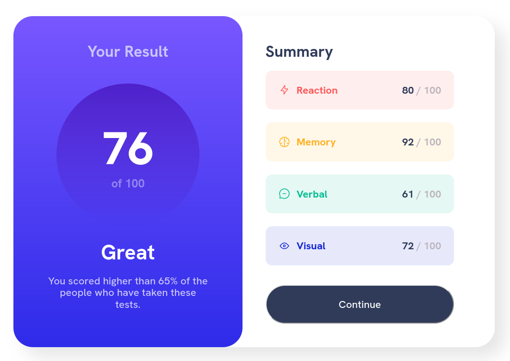

# Results summary component

This is a solution to the Results summary component.

## Table of contents

- [Overview](#overview)
  - [The challenge](#the-challenge)
  - [Screenshot](#screenshot)
  - [Links](#links)
  - [Built with](#built-with)
  - [Author](#author)

## Overview

### The challenge

Users should be able to:

- View the optimal layout for the interface depending on their device's screen size
- See hover and focus states for all interactive elements on the page

### Screenshot

### Links

- Solution URL: [Github link](https://your-solution-url.com)
- Live Site URL: [Results summary component](https://results-summ-component.netlify.app/)

### Built with

- Semantic HTML5 markup
- CSS custom properties
- Flexbox
- Mobile-first workflow

## Author

- Instagram - [@thedanielcodes](https://www.instagram.com/thedanielcodes/)
- Twitter - [@dnomjr](https://twitter.com/dnomjr)

